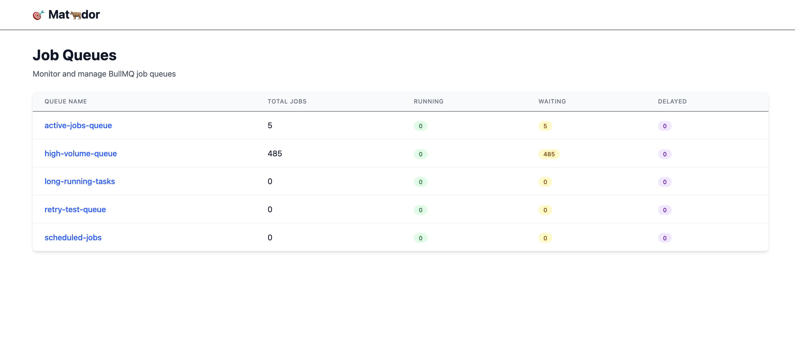
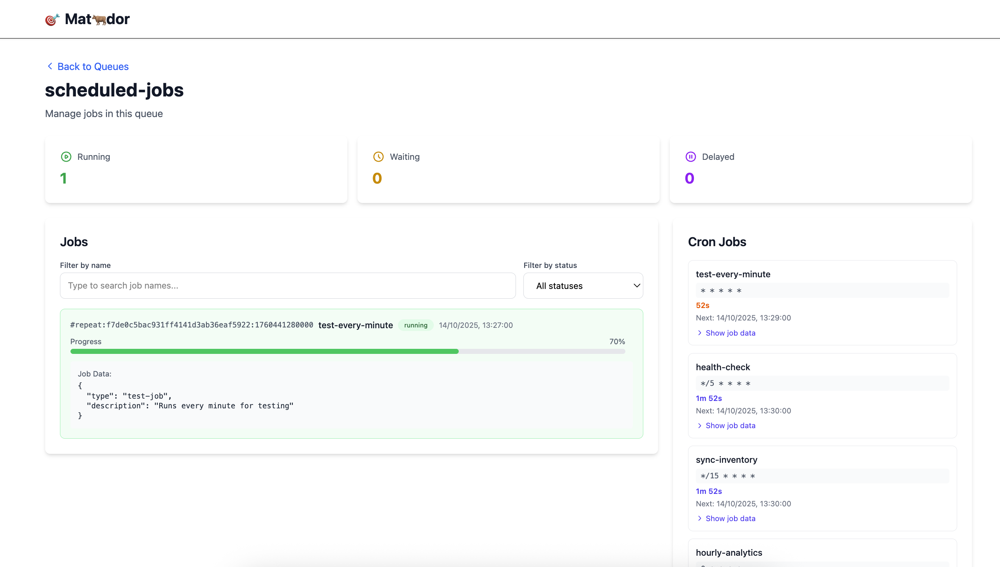
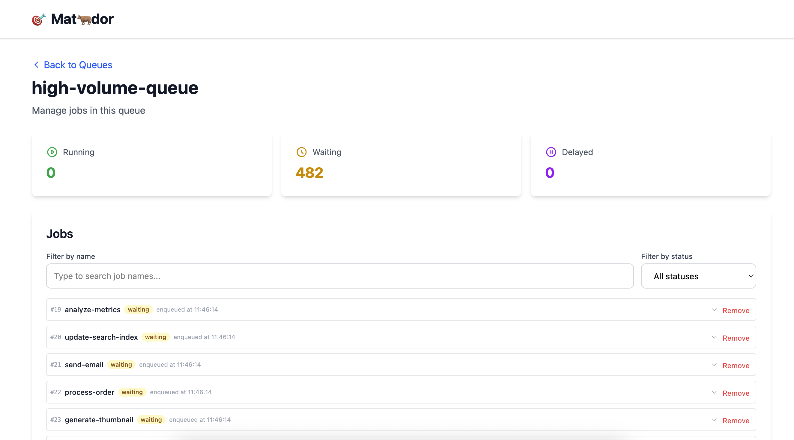

# Matador

A modern BullMQ dashboard for monitoring and managing job queues.

## Prerequisites

- Node.js 18+ or compatible runtime
- pnpm 10.18.2+
- Redis server (for BullMQ queues)

## Quick Start

1. **Install dependencies:**

   ```bash
   pnpm install
   ```

2. **Configure Redis connection:**

   ```bash
   cp .env.example .env
   # Edit .env and set your REDIS_URL (default: redis://localhost:6379/0)
   ```

3. **Start development server:**

   ```bash
   pnpm dev
   ```

4. **Open your browser:**
   Navigate to `http://localhost:5173`

## Development

- `pnpm dev` - Start development server
- `pnpm build` - Build for production
- `pnpm start` - Start production server
- `pnpm typecheck` - Run TypeScript type checking

## Environment Variables

- `REDIS_URL` - Redis connection URL (default: `redis://localhost:6379/0`)

## Screenshots

### Queue overview



### Queue details





## License

MIT
